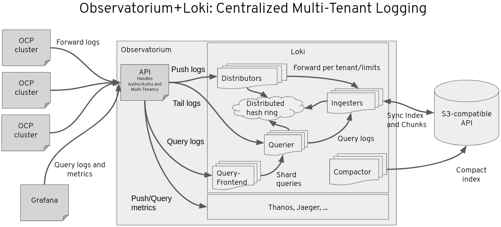

# Observatorium

Observatorium is a collection of services unified behind a single API to provide a scalable, multi-tenant observability platform for ingesting and querying logs and metrics and other observability signals. Its [documentation can be found on github](https://github.com/observatorium/docs)

# Observatorium Metrics

Observatorium Metrics, which is a general-purpose, scalable, multi-tenant, observability platform for ingesting and querying metrics. Its [documentation can be found on github](https://github.com/observatorium/docs/blob/master/design/metrics.md)

# Observatorium Logs

Observatorium logs implements a logging solution to allow multiple instances of OCP clusters store their logs to a central location. It is itself built on Observatorirum and Loki, which is a scalable multi-tenant platform for ingesting and querying logs. Its [documentation can be found on github](https://github.com/observatorium/docs/blob/master/design/logs.md). Loki's documentation be found on [Grafana Loki Documentation](https://grafana.com/docs/loki/latest/configuration/) page.

# Resources

## Endpoints

| Endpoint | Description | URL |
|---|---|---|
| observatorium-logs | The Observatorium Logs API | https://observatorium.api.openshift.com/api/logs/v1/\<TENANT NAME\>/loki/api/v1/\<RESOURCE\> |
| observatorium-metrics | The Observatorium Metrics API | https://observatorium.api.openshift.com/api/metrics/v1/\<TENANT NAME\>/api/v1/\<RESOURCE\> |

## Source Code

| Resource | Location |
|---|---|
| API | https://github.com/observatorium/observatorium |
| API OPA-AMS | https://github.com/observatorium/opa-ams |
| Config | https://github.com/observatorium/configuration |
| Upstream config | https://github.com/observatorium/deployments |

## Dependencies
| Dependency | Description |
|---|---|
| sso.redhat.com | Authentication provider |
| AMS | Authorization provider |
