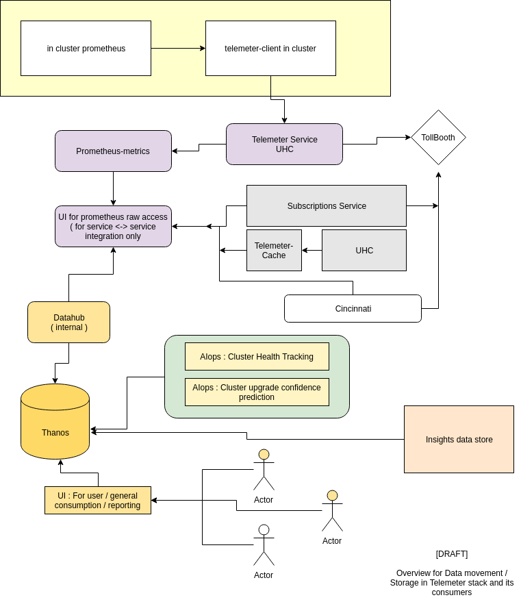

# telemeter

Telemeter implements a Prometheus federation push client and server to allow isolated Prometheus instances that cannot be scraped from a central Prometheus to instead perform push federation to a central location.

In the context of OCP 4, telemeter is used to push cluster metrics to the 'infogw' prometheus.

More info here: https://github.com/openshift/telemeter/

Telemeter v2 motivaations and high-level design doc can be found [here](https://docs.google.com/document/d/1A9BUogtU3aNTV8hiTKbmn_kR-C2jSwo-07OyT3nm9bU). It is itself built on Observatorium, which is a general-purpose, scalable, multi-tenant, observability platform for ingesting and querying metrics and other observability signals. Its [documentation can be found on github](https://github.com/observatorium/docs)

# Resources

## Endpoints

| Endpoint | Description | URL |
|---|---|---|
| infogw | telemeter-server | https://infogw.api.openshift.com/ |
| infogw-data | prometheus | https://infogw-data.api.openshift.com/ |
| infogw-proxy | cortex proxy | https://infogw-proxy.api.openshift.com/ |

## Code

### telemeter
| Resource | Location |
|---|---|
| Upstream | https://github.com/openshift/telemeter |
| CI/CD | https://ci-int-jenkins.rhev-ci-vms.eng.rdu2.redhat.com/view/telemeter/ |
| saas repo | https://gitlab.cee.redhat.com/service/saas-telemeter |

### telemeter-proxy
| Resource | Location |
|---|---|
| Config | https://github.com/observatorium/configuration |
| CI/CD | https://ci-int-jenkins.rhev-ci-vms.eng.rdu2.redhat.com/view/telemeter/ |
| saas repo | https://gitlab.cee.redhat.com/service/saas-telemeter |

## Dependencies
| Dependency | Description |
|---|---|
| UHC | Authorization of client uploads |
| UHC | UHC prometheus for subscription_labels federation |
