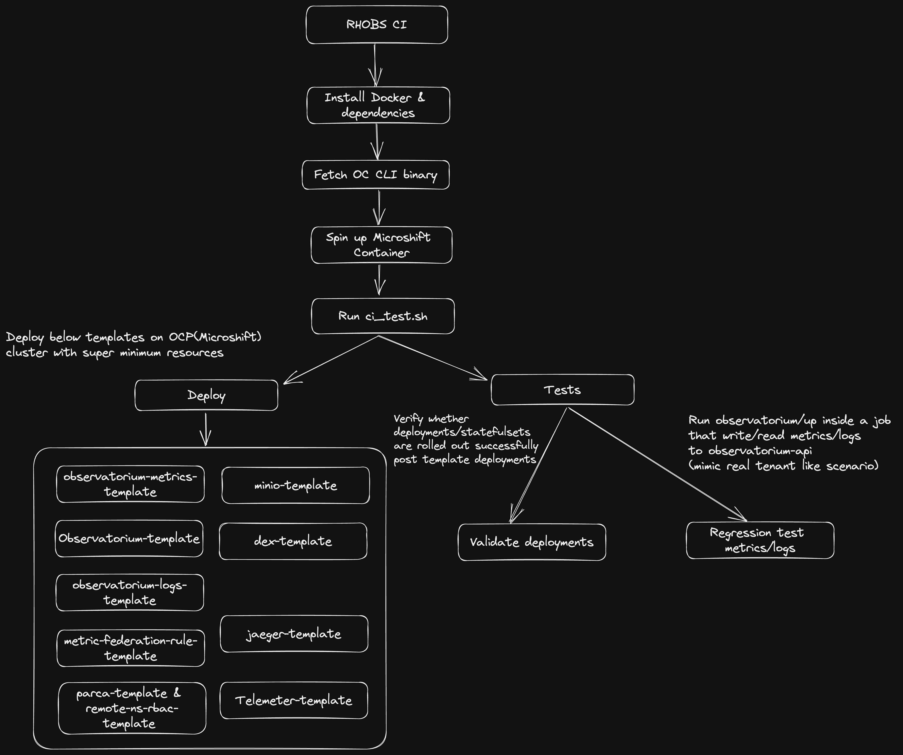

## RHOBS CI

This document provides an overview of the CI implementation that has been set up for this repository and running via [CircleCI](https://app.circleci.com/pipelines/github/rhobs/configuration). This CI validates the OpenShift specific templates by deploying them and running `observatorium-up` tests to ensure that in/out works fine.

### Design

### Implementation Details
- [Microshift](https://github.com/openshift/microshift) is used as a light-weight alternative to standard OpenShift Kubernetes.
- CircleCI has been chosen as the CI/CD platform to support the resource requirement to deploy complete RHOBS stack.
- `observatorium/up` is used for read/write metrics/logs onto deployed stack for testing.
- External objects dependicies like secrets and service accounts is replaced by manifests in the `test` directory.
- [Red Hat External SSO](https://sso.redhat.com/auth/realms/redhat-external) which serves as an OIDC provider is replaced by a local installation of [dex](https://dexidp.io/).
- The object storage normally provided by S3 is replaced by a local installation of [minio](https://min.io/).
- Some template parameters are overriden in order to make the deployments suitable for CI like:
  - CPU requests/limit, Memory request/limits and PVC storage are decreased so that RHOBS can be deployed on smaller clusters.
  - Number of replicas for components is decreased as well in order for the deployment to not be too resource heavy.
  - Objects names like service accounts, storage classes, secrets are replaced to work with local environment.
  > :bulb: **Note:** These parameters can be edited accordingly and as per the requirement in `<namespace>.test.ci.env` files.

### Build Process
- Whenever new code is pushed or new PR is created to rhobs/configuration CircleCI is triggered to build and test the manifests.
- The CircleCI [configuration file](https://github.com/rhobs/configuration/blob/main/.circleci/config.yml) consist of steps to be followed as per the design.
- [ci_test.sh](https://github.com/rhobs/configuration/blob/main/tests/ci/ci_test.sh) takes care of deploying the manifests and running tests
### Limitations
- Since some template parameters are overriden in order to make deployment smooth on CI, so sanity of those paramters are not done. For e.g defining 4Gi in cpu request and "4" memory request.
- CI doesn't deploy the Loki operator for meta-monitoring templates. It deploys the necessary CRDs like Lokistack and then apply the template to verify syntactic errors.